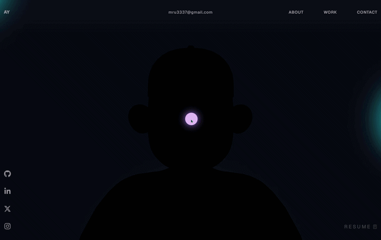

# My Portfolio

A personal portfolio website built to showcase my projects, skills, and experience as a Full Stack Developer.
The site features an interactive 3D character with bone-driven animations, scroll-triggered effects powered by GSAP,
an encrypted model pipeline with client-side decryption, and a fully responsive layout across desktop and mobile.

 

 

## Preview

---

## Tech Stack

| Category | Technology | Purpose |
|---|---|---|
| Framework | `React 18` | Component-based UI architecture |
| Language | `TypeScript` | Type safety across all components and utilities |
| Build Tool | `Vite` | Fast dev server and optimized production builds |
| 3D Rendering | `Three.js` | Scene setup, character rendering, lighting and HDR environment |
| Animations | `GSAP` | Scroll-triggered transitions, text splits and entrance effects |
| 3D Compression | `Draco` | Compressed geometry decoding for optimized model loading |
| Styling | `CSS` | Component-scoped stylesheets with custom cursor and responsive layout |

---

## Features

- **3D Character** — fully rigged Three.js character with bone-driven animations, HDR environment lighting, and mouse-reactive movement
- **Model Encryption** — the 3D model is stored encrypted and decrypted entirely on the client side, protecting the asset from direct download
- **GSAP Animations** — scroll-triggered section transitions, split text reveals, and initial load effects throughout the page
- **Custom Cursor** — fully custom cursor with hover state changes and link interaction effects
- **Responsive Design** — optimized layout for both desktop and mobile with a dedicated mobile still for the 3D character
- **Loading Screen** — managed loading state via React context that gates the main content until all assets are ready

---

## Getting Started

~~~bash
# 1. Clone the repo
git clone https://github.com/code2ahm/myfolio.git
cd myfolio

# 2. Install dependencies
npm install

# 3. Run the dev server
npm run dev
~~~

Dev server runs at `http://localhost:5173`

---

## Project Structure

~~~
src/
├── components/
│   ├── Character/              # Three.js 3D character setup
│   │   ├── utils/
│   │   │   ├── animationUtils.ts   # Bone animation logic
│   │   │   ├── character.ts        # Model loading and scene attachment
│   │   │   ├── decrypt.ts          # Client-side model decryption
│   │   │   ├── lighting.ts         # HDR environment and light setup
│   │   │   ├── mouseUtils.ts       # Mouse tracking for character movement
│   │   │   └── resizeUtils.ts      # Camera and renderer resize handling
│   │   ├── Scene.tsx               # Three.js scene component
│   │   ├── index.tsx               # Character component entry
│   │   └── exports.ts              # Shared exports
│   ├── styles/
│   │   ├── About.css
│   │   ├── Career.css
│   │   ├── Contact.css
│   │   ├── Cursor.css
│   │   ├── Landing.css
│   │   ├── Loading.css
│   │   ├── Navbar.css
│   │   ├── SocialIcons.css
│   │   ├── Techstack.css
│   │   ├── WhatIDo.css
│   │   ├── Work.css
│   │   └── style.css
│   ├── utils/
│   │   ├── GsapScroll.ts           # Scroll-triggered animation setup
│   │   ├── initialFX.ts            # Page load entrance effects
│   │   └── splitText.ts            # GSAP text split utility
│   ├── About.tsx
│   ├── Career.tsx
│   ├── Contact.tsx
│   ├── Cursor.tsx
│   ├── HoverLinks.tsx
│   ├── Landing.tsx
│   ├── Loading.tsx
│   ├── MainContainer.tsx
│   ├── Navbar.tsx
│   ├── SocialIcons.tsx
│   ├── TechStack.tsx
│   ├── WhatIDo.tsx
│   ├── Work.tsx
│   └── WorkImage.tsx
├── context/
│   └── LoadingProvider.tsx     # Global loading state management
├── data/
│   └── boneData.ts             # Bone names and animation keyframe data
├── types/
│   └── gsap-trial.d.ts         # GSAP TypeScript declarations
├── assets/
│   └── react.svg
├── App.css
├── App.tsx
├── index.css
├── main.tsx
└── vite-env.d.ts
~~~

---

built by <a href="https://github.com/code2ahm">code2ahm</a> · <a href="https://devahm.xyz">portfolio</a>

